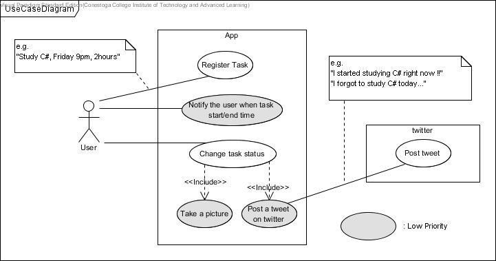
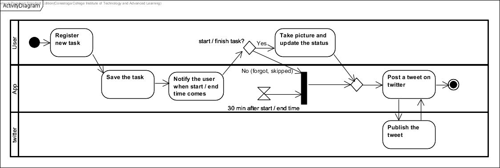

# Nagging Reminder (Prototype)
This app reminds user of his/her tasks, especially such as study and homework. In order to make it sure that the user REALLY starts/finishes the task, the user has to take a picture related to the task as an evidence (e.g. text book). Then, the app automatically posts it on twitter so that his/her friends can check it. It may also motivate the user.

## Functions
### implemented
- Register a task
- Modify registered task
- Update task status
- Take picture

### not yet
- Notify (unable to run as a service with PhoneGap...)
- Post a tweet on twitter

## Environment
- Android

## Development Environment
- PhoneGap (Cordova)
- Ionic
- AngularJS

## Build & Run
* %> cordova plugin add org.apache.cordova.camera
* %> cordova platform add android
* %> cordova build android
* %> cordova run android
* probably able to use ionic and phonegap instead of cordova
* also, this may work: %> phonegap remote build android

